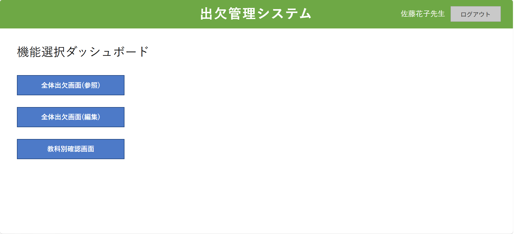
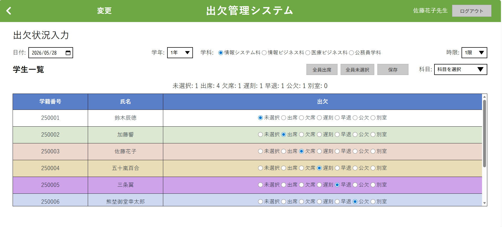
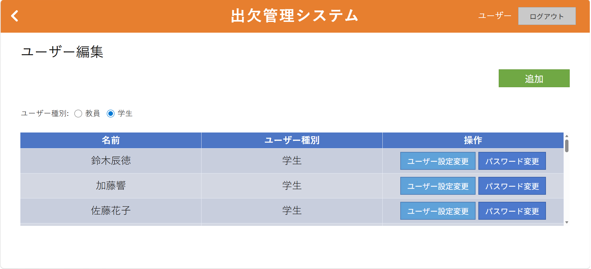
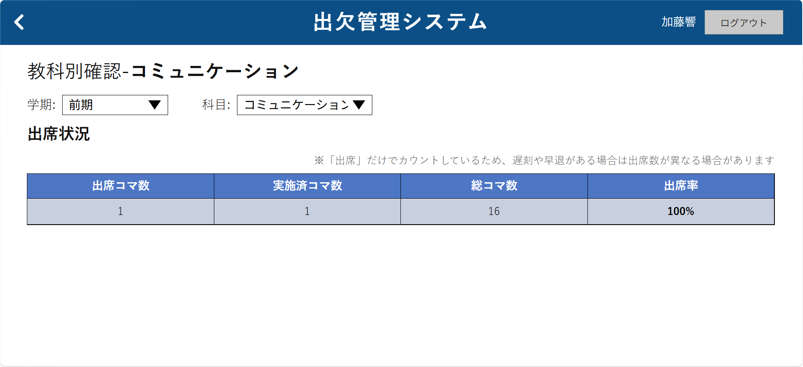

# Attendance-management-system

## 概要

教員の出欠管理業務を効率化するために制作した、学校向けの出欠管理システムです。

---

## 制作背景

授業ごとの出欠確認や管理業務を効率化し、  
教員・生徒双方が出席状況を確認しやすくすることを目的として制作しました。

---

## 実装済み機能

### 共通機能
- ログイン / ログアウト
- セッション管理
- ロール別画面制御

### 教員機能
- 出欠登録
- 出欠編集
- 授業別出欠確認
- 出席率確認

### 生徒機能
- 自身の出席状況確認
- 教科別出席率確認

### 管理者機能
- ユーザー編集
- パスワード変更

### その他
- トランザクション処理
- ロールバック処理

---

## 画面一覧

### 教員画面

- ログイン
- 機能選択ダッシュボード
- 全体出欠画面（参照）
- 全体出欠画面（編集）
- 教科別確認

### 生徒画面

- ログイン
- 機能選択ダッシュボード
- 教科別確認

### 管理者画面

- ログイン
- 機能選択ダッシュボード
- ユーザー編集
- ユーザー設定変更
- パスワード変更

---

## 画面イメージ

### 教員ダッシュボード

教員用の機能選択画面。



---

### 出欠入力画面

授業ごとの出欠登録・編集機能。



---

### 管理者ユーザー編集画面

管理者によるユーザー管理機能。



---

### 生徒出席確認画面

教科別の出席コマ・出席率表示



---

## 使用技術

### フロントエンド
- HTML
- CSS
- JavaScript

### バックエンド
- PHP

### データベース
- MySQL（MariaDB）

### 開発環境
- XAMPP
- VirtualBox
- Ubuntu Server

---

## 工夫した点

- 管理者 / 教員 / 生徒ごとに利用可能機能と画面を分離
- PDOを利用した安全なDB接続
- トランザクション処理によるデータ整合性維持
- VirtualBox 上に Ubuntu Server 環境を構築し、Apache / PHP / MariaDB による動作確認を実施
- .gitignore や db.sample.php を利用し、機密情報をGitHub公開対象から除外

---

## フォルダ構成

```text
Attendance-management-system
│
├ public
│   ├ index.html
│   ├ assets
│   │   ├ css
│   │   ├ js
│   │   └ images
│   │
│   └ pages
│       ├ admin
│       ├ student
│       └ teacher
│
├ backend
│   ├ config
│   │   └ db.sample.php
│   │
│   └ php
│
├ db
│   ├ teachers.sql
│   ├ students.sql
│   ├ attendances.sql
│   └ ...
│
├ README.md
└ .gitignore
```

※ セキュリティおよび個人情報保護のため、
テストデータ投入用SQLや機密情報を含む設定ファイルは公開対象から除外しています。

---

## セットアップ

1. XAMPPを起動
2. Apache / MySQL を開始
3. db フォルダ内の SQL ファイルを phpMyAdmin からインポート
4. ブラウザで `public/index.html` にアクセス

---

## DB設定

`backend/config/db.sample.php` を参考に、
`db.php` を作成してください。

---

## 要件定義

- 授業開始時に教員が出欠を入力
    - 担当教員選択
    - 担当コマ選択
    - 出欠入力

- ユーザー管理（教員 / 生徒 / 管理者）
    - 管理者
        - 教員アカウントの追加
        - 生徒アカウントの追加
    - 教員
        - 出欠入力
        - 各生徒の出席率確認
    - 生徒
        - 自身の出席率確認

- 帳票出力機能
- 授業コマ単位での集計機能

---

## 今後の課題
- 教員アカウント追加機能
- 生徒アカウント追加機能
- 教科編集 / 追加 / 削除
- 編集ログ保存機能
- ログ閲覧機能
- バリデーション強化
- 権限制御の強化
- セキュリティ強化
- UI / UX改善（レスポンシブ対応含む）
- 帳票出力機能の改善
